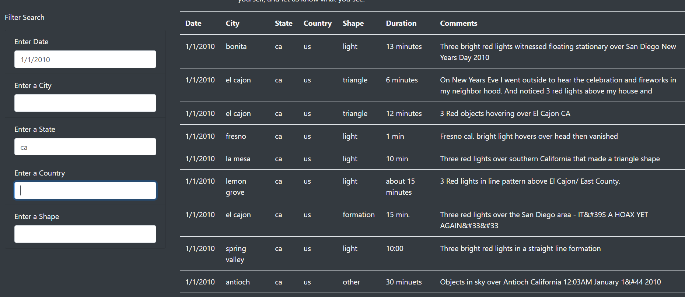
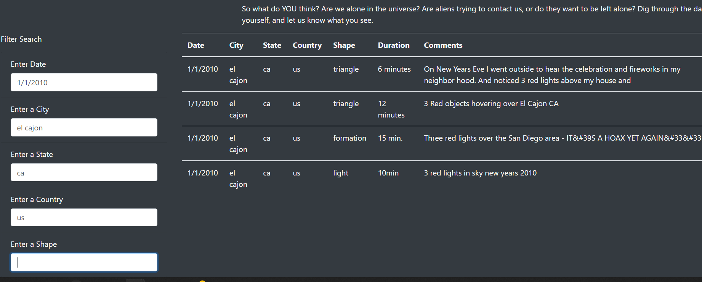
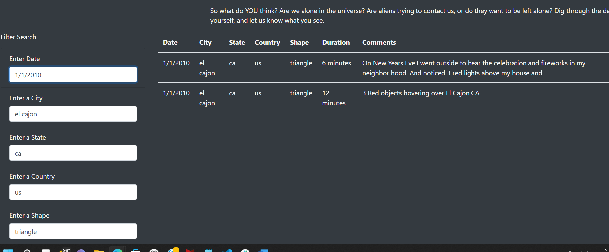

# UFO-sightings

## Overview of the analysis:

The purpose of this analysis is to build a  dynamic UFO table webpage using data stored in a Javascript array. The webpage is customized using bootstrap and the  multiple filters allow the users to filter the data they need.

## Results:
Users can filter on one or more of the following  criteria to get the results - Date, City,State,Country and Shape. If no inputs provided, the entire data would be displayed.

## Summary:

One of the drawbacks of this webpage is missing the "Filter Results" button to filter the results. It might be confusing for the users and might take few trials to figure out how the search criteria works without the filter button.One recommendation to improve the page would be to use the filter results button based on the criterial entered. Additionally, the shape data contains not just the shape data, we can see values like light, unknown, formation, flash etc. I believe a drop down with valid values in the shape field would be more meaningful to filter the data that the users would like to see. 

